# .NET Clean Architecture Agent System

## What This Is

A coordinated multi-agent system for **any .NET development task**. The **Orchestrator Skill** analyzes your request and automatically coordinates specialized **Subagents** to deliver production-ready code following Clean Architecture principles.

**Key Point:** You don't need to know which agent or skill to use. Just describe what you need in plain language via `/orchestrator`, and it intelligently determines which subagents to activate and in what order. This works for simple tasks (single agent) or complex features (coordinated multi-agent execution).

> **Inspiration:** This repository was forked off of [dotnet-clean-architecture-skills](https://github.com/ronnythedev/dotnet-clean-architecture-skills) as inspiration for the Clean Architecture skills section.

## How to Use It

### Invoke the Orchestrator Skill

```
/orchestrator Create a Product entity with CRUD operations
```

The orchestrator skill runs in your main Claude Code window, analyzes your request, and coordinates the appropriate subagents automatically. You don't need to know which agents to call - just describe what you need.

### Single Agent vs Orchestrated Workflow

```mermaid
flowchart LR
    subgraph single[" "]
        direction TB
        U1[👤 User] --> A1[🤖 Single Agent]
        A1 --> U1

        A1 ~~~ RISK["❌ RISKS
• Context diluted
• More hallucinations
• Many iterations"]
    end

    subgraph orch[" "]
        direction TB
        U2[👤 User] <--> O[🎯 Orchestrator]

        O <--> SA1[🏛️ Domain Agent]
        O <--> SA2[⚙️ Infra Agent]
        O <--> SA3[📱 App Agent]
        O <--> DOTS[...]
        O <--> SA4[📦 Agent N]

        SA1 --> SK1[📚 Skill 1]
        SA1 --> SK2[📚 Skill 2]
        SA2 --> SK2
        SA2 --> SK3[📚 Skill 3]
        SA3 --> SK3
        SA3 --> SK4[📚 Skill 4]
        SA4 --> SK4
        SA4 --> SKN[📚 Skill N]

        O ~~~ WIN["✅ BENEFITS
• Preserves vision
• Splits context
• Runs in parallel"]
    end

    single ~~~ orch

    style single fill:#fecaca,stroke:#dc2626,stroke-width:2px,color:#000
    style orch fill:#bbf7d0,stroke:#16a34a,stroke-width:2px,color:#000
    style U1 fill:#fbbf24,stroke:#b45309,color:#000
    style A1 fill:#f87171,stroke:#b91c1c,color:#000
    style RISK fill:#fca5a5,stroke:#dc2626,color:#000
    style U2 fill:#fbbf24,stroke:#b45309,color:#000
    style O fill:#3b82f6,stroke:#1d4ed8,color:#fff
    style SA1 fill:#a78bfa,stroke:#7c3aed,color:#000
    style SA2 fill:#a78bfa,stroke:#7c3aed,color:#000
    style SA3 fill:#a78bfa,stroke:#7c3aed,color:#000
    style SA4 fill:#a78bfa,stroke:#7c3aed,color:#000
    style DOTS fill:#e5e7eb,stroke:#6b7280,color:#000
    style SK1 fill:#67e8f9,stroke:#0891b2,color:#000
    style SK2 fill:#67e8f9,stroke:#0891b2,color:#000
    style SK3 fill:#67e8f9,stroke:#0891b2,color:#000
    style SK4 fill:#67e8f9,stroke:#0891b2,color:#000
    style SKN fill:#67e8f9,stroke:#0891b2,color:#000
    style WIN fill:#86efac,stroke:#16a34a,color:#000
    linkStyle default stroke:#000,stroke-width:2px
```



### Why a Skill Instead of a Subagent?

**Technical Limitation:** In Claude Code, subagents cannot spawn other subagents. This is a platform constraint that necessitates the skill-based orchestrator pattern.

**How It Works:**
1. You load the orchestrator skill into your main Claude Code CLI window
2. The skill runs in your primary conversation context
3. When you make a request, the orchestrator analyzes it and determines which subagents to activate
4. The orchestrator sequentially invokes the appropriate subagents in the correct order
5. Each subagent executes its specialized task and returns results to the main context

**For Cursor Users:** The same pattern works in Cursor. While Cursor's nested subagent capabilities may differ, using a skill-based orchestrator provides a consistent approach across both platforms and ensures maximum compatibility.

## What It Understands

**The orchestrator handles ANY .NET coding task** - from simple utility classes to complex multi-layer features. You don't need to understand Clean Architecture or know which agent to use. Just describe what you need, and it figures out the rest.

The orchestrator dynamically analyzes your request and activates the appropriate agents:

| You Ask For | It Activates | Why |
|-------------|--------------|-----|
| "Create Order entity" | Domain Agent | Pure domain modeling |
| "Add CreateOrder command" | Application Agent | CQRS command with handler |
| "Setup email notifications" | Infrastructure Agent | External service integration |
| "Create Products API" | Domain → Application → Infrastructure → API | Full CRUD feature |
| "Build user dashboard" | Application → API → Web | Read-side + UI |
| "Implement JWT auth" | Infrastructure → API | Cross-layer security |
| "Add outbox pattern" | Infrastructure Agent | Messaging infrastructure |

Simple tasks get one agent. Complex features get coordinated multi-agent execution.

## The Subagents

The orchestrator coordinates these specialized subagents:

- **domain-agent** - Entities, value objects, domain events, business rules
- **application-agent** - CQRS commands/queries, handlers, validators, pipeline behaviors
- **infrastructure-agent** - Repositories, EF Core, Dapper, auth, email, jobs, outbox
- **api-agent** - Minimal API endpoints, versioning, authorization, middleware
- **web-agent** - UI components, forms, state management, API integration
- **mcp-agent** - MCP servers, tools, external integrations

Each subagent has access to specific skills preloaded in their context. See **[SKILLS-MAPPING.md](./SKILLS-MAPPING.md)** for the complete mapping of which skills each agent can use.

You can invoke subagents directly if you know which layer you need:

```
Use the domain-agent to create an Order entity
Use the application-agent to add a CreateOrderCommand
Use the infrastructure-agent to implement OrderRepository
```

However, using `/orchestrator` is recommended as it analyzes and coordinates automatically.

## What It Enforces

Every agent automatically follows Clean Architecture principles:

✅ **Dependencies point inward** - Domain → Application → Infrastructure → API → Web
✅ **Domain is pure** - Zero infrastructure dependencies
✅ **DDD patterns** - Entities, aggregates, value objects, domain events
✅ **CQRS** - Commands modify state, queries read data
✅ **Result pattern** - Business errors return Result, not exceptions
✅ **Repository per aggregate** - One repo per aggregate root
✅ **Proper encapsulation** - Private setters, factory methods, protected invariants

## Example Requests

### Simple
```
/orchestrator Create a Category entity with name and description
```

### Medium
```
/orchestrator Add order approval workflow with these rules:
- Orders over $10k require manager approval
- Approved orders send email notification
- Rejected orders include reason
```

### Complex
```
/orchestrator Build a complete survey system with:
- Survey aggregate with questions and responses
- CRUD operations for surveys
- Submit response workflow
- Analytics query for results
- Admin API endpoints
- Survey UI for respondents
```

## Pro Tips

### Be Specific
❌ "Add validation"
✅ "Add validation: email must be unique, password min 8 chars with special char"

### Include Business Rules
❌ "Create Order entity"
✅ "Create Order entity that can only be approved if total > 0 and user has approval permission"

### Mention Relationships
❌ "Create Product"
✅ "Create Product entity with Category reference and Inventory child entity"

### State Technical Requirements
❌ "Add authentication"
✅ "Add JWT authentication with refresh tokens and role-based authorization"

## What Gets Generated

For a typical CRUD feature, you get:

**Domain Layer**
- Entity with private setters, factory methods, validation
- Value objects (if needed)
- Domain events (Created, Updated, Deleted)
- Repository interface
- Error definitions
- Specifications (for complex queries)

**Application Layer**
- Create/Update/Delete commands with handlers
- Get/List/Search queries with handlers
- FluentValidation validators
- Domain event handlers
- Response DTOs

**Infrastructure Layer**
- Repository implementation
- EF Core entity configuration
- Database migration (if needed)
- Dapper queries (for performance-critical reads)

**API Layer**
- Minimal API endpoints (Microsoft's recommended approach)
- Request/Response DTOs
- Authorization attributes
- TypedResults with proper HTTP status codes

**Plus**
- Unit tests for each layer
- Integration tests for workflows
- XML documentation
- Proper async/await with CancellationToken

## Advanced Usage

### If You Know Which Layer
You can invoke subagents directly (but orchestrator is usually better):

```
Use the domain-agent to create Order aggregate with OrderItem children
Use the application-agent to add ProcessRefund command
Use the infrastructure-agent to setup Quartz job to process pending orders
Use the api-agent to create Orders endpoints with custom search
```

### Reference Material
- [`SKILLS-MAPPING.md`](./SKILLS-MAPPING.md) - Complete mapping of which skills each subagent has access to
- `skills/orchestrate-ca-agents/` - Orchestrator skill documentation
- `skills/` - Individual skill documentation with detailed patterns (27 specialized skills)
- `agents/` - Subagent configuration files

## Technical Architecture

### How It Works

1. **Orchestrator Skill** (`skills/orchestrate-ca-agents/`)
   - Runs in main conversation context (your CLI window in Claude Code)
   - Analyzes requests and creates execution plans
   - Coordinates subagent invocation sequentially
   - Passes context between subagents
   - **Critical:** This is a skill, not a subagent, because subagents cannot spawn other subagents in Claude Code

2. **Specialized Subagents** (`agents/`)
   - Run in isolated contexts separate from the main conversation
   - Have specific tool access and preloaded skills
   - Return results to main conversation
   - **Limitation:** Cannot spawn other subagents - this is why orchestration must happen at the skill level

3. **Skills** (`skills/`)
   - Loaded into agent contexts at startup (via YAML frontmatter)
   - Provide domain knowledge and patterns
   - The orchestrator skill is special: it runs in the main context, not in a subagent
   - Other skills are preloaded into specific subagents based on their layer responsibilities

### Clean Architecture Dependency Rule

```
Domain ← Application ← Infrastructure ← API ← Web
```

The orchestrator enforces this dependency rule across all generated code.

## Installation & Storage

You can store these files at different levels depending on your needs:

### Repository Level (Project-Specific)
```
your-project/
├── .claude/
│   ├── skills/
│   └── agents/
# OR
├── .cursor/
│   ├── skills/
│   └── agents/
```

### Global Level (All Projects)
```
~/.claude/
├── skills/
└── agents/
# OR
~/.cursor/
├── skills/
└── agents/
```

**Recommendation:** Use repository-level storage for project-specific customizations, and global storage for reusable patterns across all your .NET projects.

### Learn More About Subagents
- **Cursor Documentation:** [Subagents Guide](https://cursor.com/docs/context/subagents)
- **Claude Code Documentation:** [Sub-Agents Guide](https://code.claude.com/docs/en/sub-agents)

## That's It

You now have an intelligent assistant that understands .NET Clean Architecture patterns, coordinates specialist agents, and generates production-ready code.

**Just call `/orchestrator` and describe what you need.**

---

**Questions?** The orchestrator can explain its decisions and suggest alternatives. Just ask.
